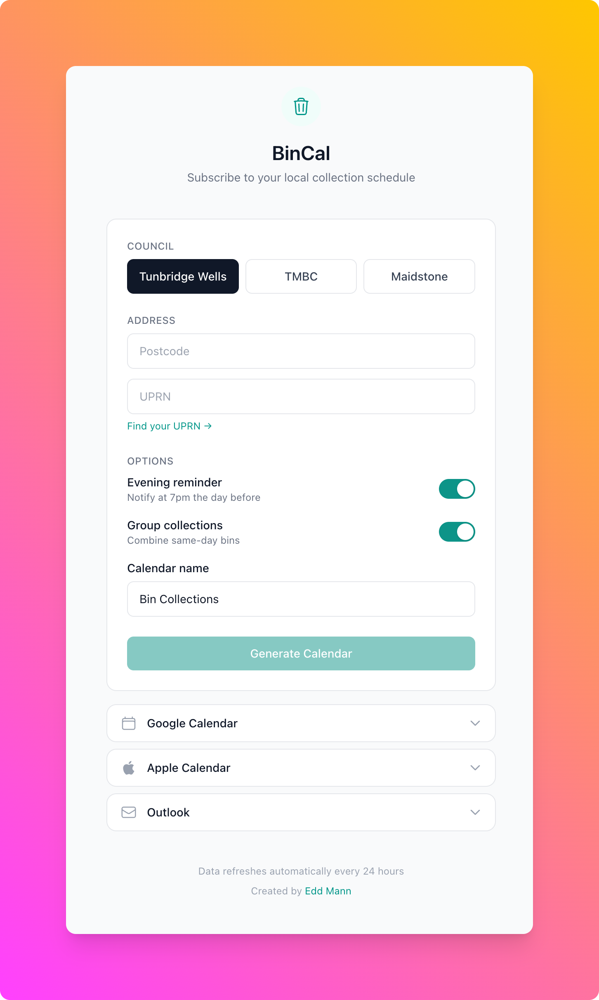

# BinCal

I keep forgetting to put the bins out and can never remember which week is which bin. My council doesn't offer calendar subscriptions or an API, so I built this for myself and friends from neighbouring councils in the same situation.



## Supported councils

- Tunbridge Wells - uses UPRN
- Tonbridge & Malling (TMBC) - uses UPRN
- Maidstone - uses house number

## Tech stack

React 19, TypeScript, Tailwind CSS v4, Cloudflare Workers, Cloudflare KV, Vite, Bun

## Getting started

Prerequisites: [Bun](https://bun.sh/) and a [Cloudflare account](https://cloudflare.com/) (free tier works)

```bash
bun install

# Create the KV namespace
bunx wrangler kv namespace create CACHE
# Copy the id from output into wrangler.json

bun run dev
```

Open http://localhost:5173

## Deployment

```bash
bunx wrangler login
bun run ship
```

## API

iCal calendar (for subscribing):
```
/calendar.ics?council={council}&postcode={postcode}&property={property}
```

JSON:
```
/api/bins?council={council}&postcode={postcode}&property={property}
```

Optional: `reminder` (default 19:00), `group` (default true), `name`, `download`

Data is cached for 24 hours to avoid hammering the council websites.

## Examples

Tunbridge Wells (town centre):
```
/api/bins?council=tunbridge-wells&postcode=TN1+2SS&property=000000000000
```

TMBC (Tonbridge area):
```
/api/bins?council=tmbc&postcode=TN9+1EE&property=000000000000
```

Maidstone (town centre):
```
/api/bins?council=maidstone&postcode=ME14+1PT&property=1
```

## Finding your property reference

For Tunbridge Wells and TMBC, look up your UPRN at findmyaddress.co.uk. For Maidstone, just use your house number (e.g. 25, Flat 2).

## Project structure

```
src/
├── pages/          Home page with form
├── lib/            API client, URL builders
└── index.css       Tailwind styles

worker/
├── councils/       Council scrapers (tmbc, tunbridge-wells, maidstone)
├── routes/         calendar.ts (iCal), api.ts (JSON)
├── lib/            iCal generation
└── types.ts        TypeScript types
```

## License

[MIT](LICENSE)
